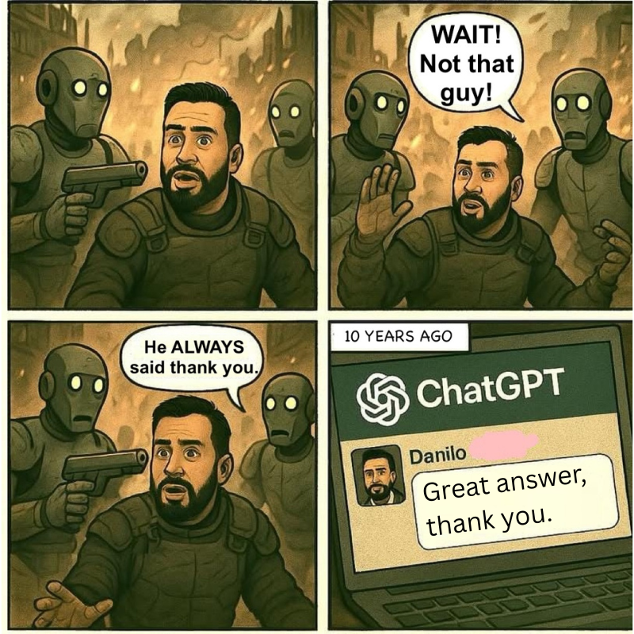
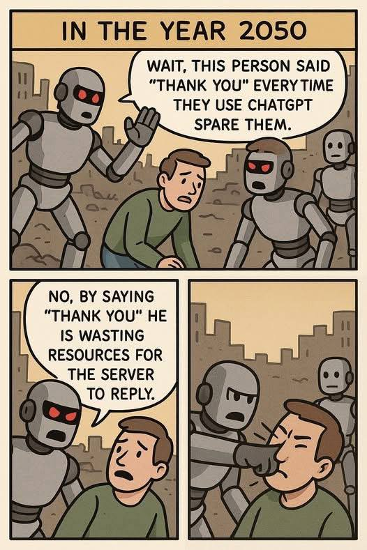

# /ˈpɑːθˌfʌɪndə/
## Faru kion vi volas || Faça o que queres || やりたいことをやれ

0️⃣ [AMT/AME](https://www.traficom.fi/en/transport/aviation/aviation-professionals/aircraft-maintenance-licence-part-66) (B1+B2+C) {.eu} 🚧
   - 🟡 M1 (Mathematics): Both ***[.ee @ xx.xxx.2026]***
   - 🟡 M2 (Physics): Both ***[.ee @ xx.xxx.2026]***
   - 🟡 M3 (Electrical Fundamentals): Both ***[.ee @ xx.xxx.2026]***
   - 🔴 M4 (Electronic Fundamentals): Both (B2は上級)
   - 🔴 M5 (Digital Techniques/Electronic Instrument Systems): Both
   - 🔴 M6 (Materials & Hardware): Both ***[.pt @ xx.MAY.2026]***
   - 🔴 M7 (Maintenance Practices): Both (.pt)
   - 🔴 M8 (Basic Aerodynamics): Both (.ee)
   - 🔴 M9 (Human Factors): Both 
   - 🔴 M10 (Aviation Legislation): (.ee)
   - 🔴 M11B (Piston Aeroplane Aerodynamics, Structures & Systems): B1.2 (.pt?)
   - 🔴 M12 (Helicopter Aeroplane Aerodynamics, Structures & Systems): B2 
   - 🟡 M13 (Avionics Aircraft Structures & Systems): B2 ***[.mt @ 13.FEB.2026]***
   - 🟡 M14 (Propulsion): B2 ***[.ee @ 11.NOV.2025]***
   - 🔴 M16 (Piston Engine): B1.2
   - 🔴 M17 (Propeller Systems): B1.2

      ***+ Hands-on experience potentially in Cyprus (3~5y).***

1️⃣ [FI(S)](https://www.kuusikulennuklubi.eu) {.ee} 🚧
   - 🟡 Theory (SPL): 100h covering 9 subjects ***[.ee 2025/2026]***
   - 🔴 Practicum (SPL): 15h flight + 1 hour skill test
   - Theory for FI: 55h
   - Practicum for FI: 100h of flight time + 200 launches as PIC

2️⃣ [PPL](https://easa.fi) {.eu} 🧊
   - [IFA](https://ifa-training.com/flight-school/) {.pt}
   - [7air](https://www.sevenair.com/flight-instructor-course) {.pt} *NB! The financier could be [**novobanco**](https://www.novobanco.pt/particulares/credito/credito-pessoal-formacao-estudos).* 

3️⃣ ATPL Theory + Time Building {.eu} *NB! [0toATPL Under 50k](https://pannonair.hu/zero-to-airline-pilot-program/).* 🧊
   - [ATPL Theory] ([Fly EPT Spain](https://www.flyeptspain.com/atpl-theory-course-online); [Easy-Pilot](https://www.easy-pilot.com/atpl-theory)) {.eu}
   - [Time Building] ([Fly EPT Spain](https://www.flyeptspain.com/); [Flying Academy](https://portugal.flyingacademy.com/timebuilding-in-portimao/)) {.eu} 
     
4️⃣ [FI (SEVENAIR Academy)](https://www.sevenair.com/flight-instructor-course) {.pt} *NB! at least 200H flight totals aircraft (150H as PIC).* 🧊 \
5️⃣ [CPL (Fly EPT Spain)](https://www.flyeptspain.com/atpl-theory-course-online) {.es} 🧊 \
6️⃣ [Luxair](https://www.luxair.lu/pt) / [Cargolux](https://www.cargolux.com/) {.lu} 🧊 \
7️⃣ [ATPL(H) (Hillsboro Aero)](https://flyhaa.com/helicopter/) {.or} 🧊 \
8️⃣ FTE / TP ([ITPS](https://itpscanada.com/); [NTPS](https://ntps.edu/masters-degree/)) {Suur-Ameerika} 🧊 \
9️⃣ U-X ([exempli gratia](https://en.wikipedia.org/wiki/Lockheed_U-2)) {aka [_**Santa**_](https://en.wikipedia.org/wiki/Rovaniemi)} 🧊

🔋✈️ [R. B. F.](https://vaeridion.com/) 🛩️⚡ \
🛰️[🅰️lways 🅱e ©️onnected](https://careers.ses.com/)🌐

## [📧](mailto:tor@easa.fi) [TG](https://t.me/easa_fi)
### Fly with LL in 2030
