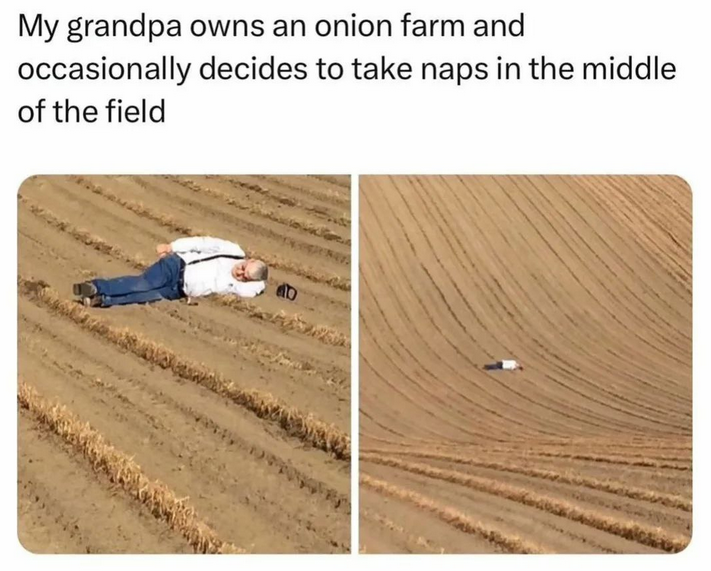

# /ˈpɑːθˌfʌɪndə/

1. [AMT/AME (IFA)](https://ifa-training.com/courses/aircraft-maintenance-technician/) {.pt}
2. [FI(S) (ASKÖ)](https://www.flugsport-wien.at/gb/segelflug/segelflugausbildung/) [.at]
3. [PPL (Flying Academy)](https://portugal.flyingacademy.com/) {.pt} 
4. [ATPL (Easy-Pilot)](https://www.easy-pilot.com/atpl-theory) {.eu}
5. [FI (SEVENAIR Academy)](https://www.sevenair.com/flight-instructor-course) {.pt} *NB! at least 200H flight totals aircraft, of which 150H as PIC (prerequisite).*
6. CPL {.hu} \
       - .. \
       - .. 

7. LUX
8. FTE / TP
9. [U-2](https://en.wikipedia.org/wiki/Lockheed_U-2)

NB! The financier could be [**novobanco**](https://www.novobanco.pt/particulares/credito/credito-pessoal-formacao-estudos).

### [📧](mailto:tor@easa.fi) [TG](https://t.me/easa_fi)
