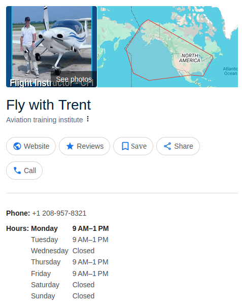

#Perphaps N/A in EU.

https://flywithtrent.com/

# Summary: How to Become a Successful Independent Flight Instructor (CFI)

This summary outlines key insights from Trent's video on building a successful career as an independent Certified Flight Instructor (CFI):

## Advantages of Being an Independent CFI vs. Employee CFI

- **Schedule Control:**  
  Independent CFIs have total control over their schedules, allowing them to organize flights efficiently and avoid downtime between lessons.

- **Student Selection:**  
  Independent CFIs can select students based on compatibility and personal preferences, ensuring better chemistry and a more enjoyable teaching experience.

## Key Considerations for Independent CFIs

### Insurance
- Trent obtained his CFI insurance from SafePilot.org, choosing maximum coverage at approximately $2,700 per year.

- **Aircraft Availability:**  
  Independent CFIs must either network with local aircraft owners or flight schools to secure aircraft for training. Owners typically carry insurance, and students may also be required to purchase renter's insurance (e.g., through AOPA).

## Scheduling Lessons

- Initially used standard two-hour blocks, but found them inefficient.
- Switched to three-hour blocks from the start, providing students approximately 2.5 hours logged per lesson.
- Three-hour blocks enable scenario-based training, combining maneuvers with realistic cross-country flights and airport operations from the beginning, enhancing student learning and enjoyment.
- Allows instructors to log more flight hours daily (around 7.5 hours/day) without excessive fatigue.

## Attracting Students

Two primary methods:

1. **Social Media Presence:**  
   Trent's YouTube channel significantly contributes to his student inquiries. Creating engaging content showcasing instructional style attracts students consistently.

2. **Networking:**  
   Personal networking at airports and pilot communities (e.g., local Facebook groups) can also attract students effectively without needing social media presence.

## Importance of Professional Website

A professional website is critical for credibility and attracting students. Essential website elements include:

- Clear information on programs and pricing.
- Aircraft details.
- Instructor profile and teaching style.
- Blog posts or videos demonstrating instructional methods.

Affordable website creation options include platforms like Fiverr or Upwork.

## Compensation as an Independent CFI

- Trent charges approximately **$70/hour** for instruction, keeping the entire fee as an independent instructor.
- Additional income streams include YouTube revenue, affiliate marketing (e.g., Amazon store), and other related activities.
- Currently earning around **$20,000/month** through combined income streams (flight instruction fees, YouTube earnings, affiliate programs).
- Earnings significantly surpass typical employee-CFI salaries but require longer working hours (up to 12-hour workdays).

## Sustainability & Career Outlook

- The intense workload (~12-hour days) is sustainable short-term (e.g., building flight hours toward ATP minimums), but likely not ideal long-term.
- After reaching ATP minimums (1,500 hours), independent CFIs can transition into airline or cargo pilot roles or continue instructing part-time or full-time with reduced workload.

---

In summary, becoming an independent CFI offers significant advantages in scheduling flexibility, income potential, student selection freedom, and overall career satisfaction. However, it requires proactive networking or effective social media marketing and careful management of scheduling and workload to avoid burnout.

Citations:
[1] https://www.youtube.com/watch?v=Uqxg4JL0Tf0
